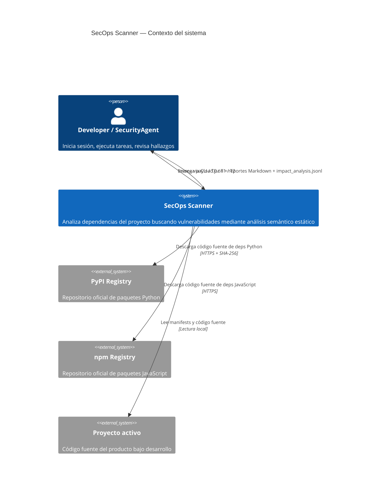
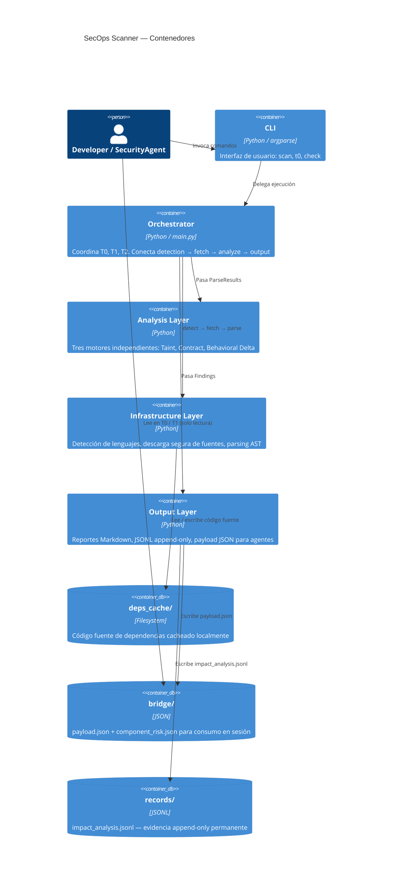
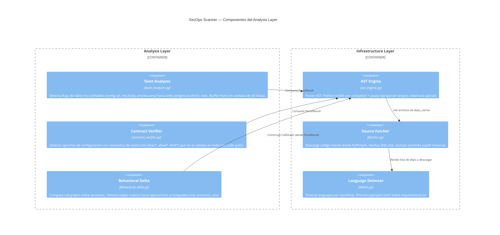
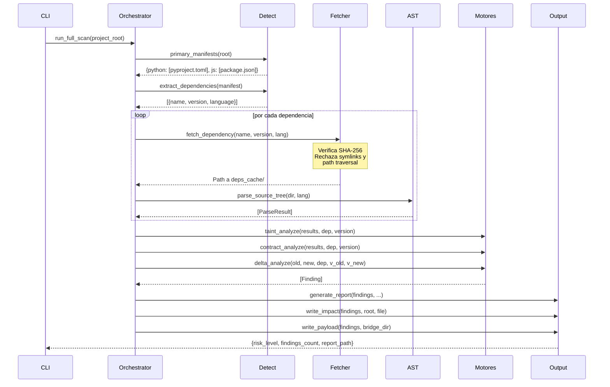

# SecOps Scanner

Módulo de análisis de seguridad semántico para dependencias Python y JavaScript.
Opera 100% local, sin LLM, sin herramientas de terceros, sin bases de datos de CVEs.

---

## Qué hace y qué no hace

**Detecta** patrones conocidos de vulnerabilidades en el código fuente real de tus dependencias:
configuraciones que no se validan en todos los code paths, flujo de datos no confiables
hacia operaciones peligrosas, y cambios de comportamiento sospechosos entre versiones.

**No es** un sustituto de auditorías humanas, herramientas de análisis formal ni bases de datos
de CVEs. Un resultado limpio no garantiza ausencia de vulnerabilidades. Ver
[docs/reliability.md](docs/reliability.md) para el análisis detallado de limitaciones.

---

## Arquitectura — Modelo C4

### Nivel 1 — Contexto del sistema



### Nivel 2 — Contenedores



### Nivel 3 — Componentes del Analysis Layer



### Nivel 4 — Flujo de datos principal



---

## Instalación

```bash
# Requiere Python 3.11+
pip install -e .

# Sin dependencias de terceros en runtime — solo stdlib Python
```

---

## Uso rápido

```bash
# T0: leer estado de seguridad al iniciar sesión (< 1s, sin scan)
python -m secops t0

# Scan completo de todas las dependencias
python -m secops scan

# Scan de una dependencia específica
python -m secops scan --dep axios

# Scan de una función específica
python -m secops scan --dep axios --method buildFullPath

# Consultar riesgo de un componente (T1, para orquestadores)
python -m secops check --component axios

# Output JSON para integración con otras herramientas
python -m secops scan --json
```

---

## Exit codes

| Código | Significado |
|---|---|
| `0` | Limpio o riesgo LOW/MEDIUM — no requiere acción inmediata |
| `1` | Hallazgos CRITICAL o HIGH — requiere revisión |
| `2` | Error de uso (argumento inválido, directorio inexistente) |

---

## Outputs

| Archivo | Descripción | Destinatario |
|---|---|---|
| `secops/bridge/payload.json` | Risk level, conteos, resumen para agente | SecurityAgent (T0) |
| `secops/bridge/component_risk.json` | Riesgo por componente/dependencia | Domain Orchestrator (T1) |
| `secops/records/impact_analysis.jsonl` | Hallazgos con reachability, evidencia, acción sugerida | Evidencia permanente / responsible disclosure |
| `secops/reports/YYYY-MM-DD_HHMM_scan.md` | Reporte completo legible por humanos | Developer / revisión manual |

---

## Motores de análisis

### Taint Analyzer
Traza flujo de datos desde fuentes no confiables (`config.url`, `req.body`, `process.env`, etc.)
hacia sinks peligrosos (`fetch`, `exec`, `Buffer.from`, `innerHTML`, etc.).
Detecta paths sin sanitización intermedia en una ventana de análisis por archivo.

**Cobertura garantizada:** CVE-2025-27152 (axios SSRF), CVE-2025-58754 (axios DoS via data: URI).

**Limitación principal:** ventana de análisis por archivo. Flujos interprocedurales o
data flow a través de variables intermedias pueden no detectarse.

### Contract Verifier
Verifica que opciones de configuración con semántica de restricción (`allow*`, `max*`, `limit*`,
`restrict*`, `safe*`, `block*`) se validen en **todos** los code paths que ejecutan
la operación que dicen restringir.

**Cobertura garantizada:** opciones ignoradas en adapters secundarios (XHR/Fetch vs HTTP),
límites de tamaño que no se aplican en paths alternativos (data: URI).

**Limitación principal:** detecta verificación por presencia de nombre, no por semántica.
Una verificación que existe pero no aplica el límite efectivamente puede pasar.

### Behavioral Delta
Construye call graphs de dos versiones y detecta edges nuevos hacia operaciones privilegiadas:
llamadas de red externas (`CRITICAL`), ejecución de procesos (`CRITICAL`), acceso a variables
de entorno (`HIGH`), escritura de archivos (`HIGH`).

**Cobertura garantizada:** supply chain attacks que introducen nuevas llamadas de red o
ejecución de procesos (caso real: axios@1.14.1 RAT).

**Limitación principal:** no detecta ataques que reutilizan operaciones ya existentes
modificando solo sus argumentos (ej: cambiar destino de `fetch` sin añadir nueva llamada).

---

## Cobertura de tests

| Módulo | Cobertura | Tests |
|---|---|---|
| `behavioral_delta.py` | 97% | Supply chain real, fix legítimo, call graph |
| `bridge.py` | 95% | Payload generation, T0/T1 read |
| `cli.py` | 95% | Todos los comandos, exit codes, arg validation |
| `detect.py` | 98% | Todos los parsers (requirements, package.json, Cargo.toml, go.mod, pyproject.toml) |
| `report.py` | 97% | Contenido Markdown, agrupación, jerarquía de riesgo |
| `contract_verifier.py` | 86% | CVE-2025-27152, CVE-2025-58754, principios |
| `taint_analyzer.py` | 85% | CVE-2025-27152, CVE-2025-58754, sanitización |
| `fetcher.py` | 86% | Hash integrity, symlinks, path traversal, zip-slip |
| `impact.py` | 83% | Append-only, deduplicación, reachability |
| **Total** | **88%** | **150 tests** |

Tests de integración verifican el pipeline completo con código real de los CVEs documentados.

---

## Limitaciones conocidas

Ver [docs/reliability.md](docs/reliability.md) para análisis detallado de:
- Qué tipos de vulnerabilidades detecta con fiabilidad
- Falsos positivos y falsos negativos documentados
- Contextos en los que **no debe usarse como garantía única** de seguridad

---

## Estructura del módulo

```
secops/
├── SECOPS.md                    # Configuración: scan_interval, targets, thresholds
├── __main__.py                  # Entry point: python -m secops
├── scanner/
│   ├── main.py                  # Orquestador T0 / T1 / T2 / run_full_scan
│   ├── detect.py                # Detección de lenguajes por manifests
│   ├── fetcher.py               # Descarga segura de fuentes (SHA-256, anti path-traversal)
│   ├── ast_engine.py            # Parser AST Python + JavaScript
│   ├── taint_analyzer.py        # Motor: flujo fuente→sink
│   ├── contract_verifier.py     # Motor: contratos de configuración
│   ├── behavioral_delta.py      # Motor: delta de call graph entre versiones
│   ├── report.py                # Generación de reporte Markdown
│   ├── impact.py                # Registro append-only JSONL
│   ├── bridge.py                # payload.json para SecurityAgent
│   ├── cli.py                   # CLI argparse
│   └── progress.py              # Barra de progreso en terminal
├── bridge/
│   ├── payload.json             # Estado de riesgo actual (T0)
│   └── component_risk.json      # Riesgo por componente (T1)
└── records/
    └── impact_analysis.jsonl    # Evidencia permanente append-only
```

---

## CI

El módulo incluye workflow de CI (`.github/workflows/secops-ci.yml`) que valida en cada
push a `staging` y `main`:

1. Integridad estructural — archivos críticos presentes
2. Cero dependencias runtime — `dependencies=[]` verificado
3. Linting — ruff sin errores
4. Tests + cobertura — pytest ≥85% global, motores ≥85%
5. Sin secretos hardcoded — scan de credenciales en código fuente
