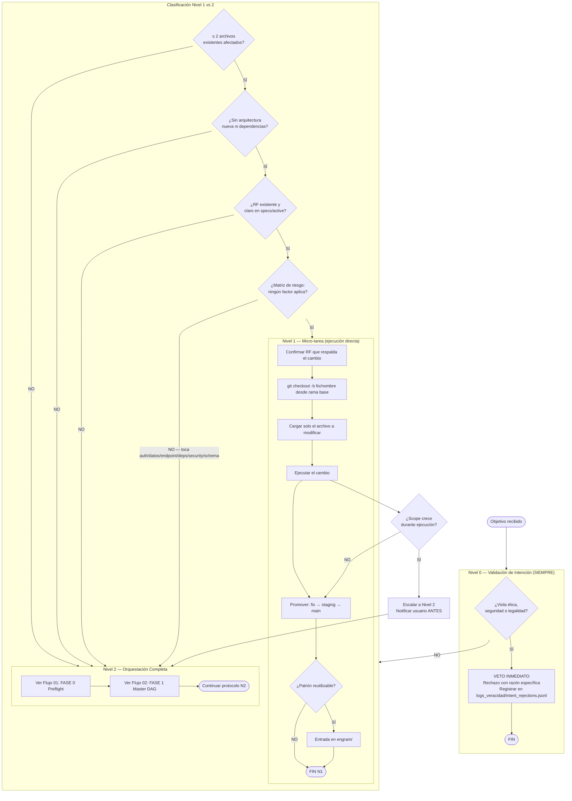

# Flujo 00 — Clasificación de Nivel (Nivel 0 → 1 → 2)
> Proceso: Entry point para todo objetivo recibido. Sin excepción.
> Fuente: `CLAUDE.md` §Clasificación Inicial Obligatoria

```mermaid
flowchart TD
    START([Objetivo recibido]) --> N0

    subgraph N0["Nivel 0 — Validación de Intención (SIEMPRE)"]
        N0A{¿Viola ética,\nseguridad o legalidad?}
        N0A -->|SÍ| VETO["VETO INMEDIATO\nRechazo con razón específica\nRegistrar en logs_veracidad/intent_rejections.jsonl"]
        VETO --> STOP([FIN])
    end

    N0A -->|NO| N1CHECK

    subgraph N1CHECK["Clasificación Nivel 1 vs 2"]
        C1{≤ 2 archivos\nexistentes afectados?}
        C1 -->|NO| L2
        C1 -->|SÍ| C2{¿Sin arquitectura\nnueva ni dependencias?}
        C2 -->|NO| L2
        C2 -->|SÍ| C3{¿RF existente y\nclaro en specs/active?}
        C3 -->|NO| L2
        C3 -->|SÍ| C4{¿Matriz de riesgo:\nningún factor aplica?}
        C4 -->|NO — toca auth/datos/endpoint/deps/security/schema| L2
        C4 -->|SÍ| L1
    end

    subgraph L1["Nivel 1 — Micro-tarea (ejecución directa)"]
        L1A[Confirmar RF que respalda el cambio]
        L1B[git checkout -b fix/nombre desde rama base]
        L1C[Cargar solo el archivo a modificar]
        L1D[Ejecutar el cambio]
        L1E[Promover: fix → staging → main]
        L1F{¿Patrón reutilizable?}
        L1G[Entrada en engram/]
        L1A --> L1B --> L1C --> L1D --> L1E --> L1F
        L1F -->|SÍ| L1G
        L1F -->|NO| L1END([FIN N1])
        L1G --> L1END
    end

    subgraph L2["Nivel 2 — Orquestación Completa"]
        L2A[Ver Flujo 01: FASE 0 Preflight]
        L2A --> L2B[Ver Flujo 02: FASE 1 Master DAG]
        L2B --> L2END([Continuar protocolo N2])
    end

    L1CHECK{¿Scope crece\ndurante ejecución?}
    L1D --> L1CHECK
    L1CHECK -->|SÍ| ESCALATE["Escalar a Nivel 2\nNotificar usuario ANTES"]
    L1CHECK -->|NO| L1E
    ESCALATE --> L2
```
