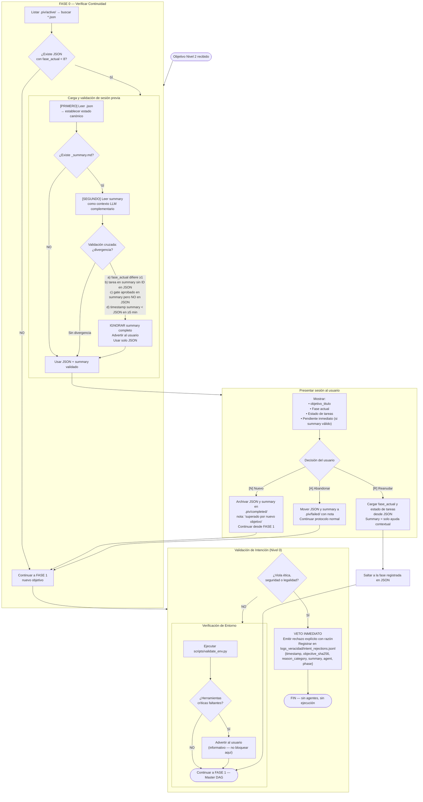

# Flujo 01 — FASE 0: Preflight + Recuperación de Sesión
> Proceso: Primer paso de toda tarea Nivel 2. Detecta sesiones previas y valida intención.
> Fuente: `registry/orchestrator.md` §Protocolo de Checkpoint, `skills/session-continuity.md` §4

