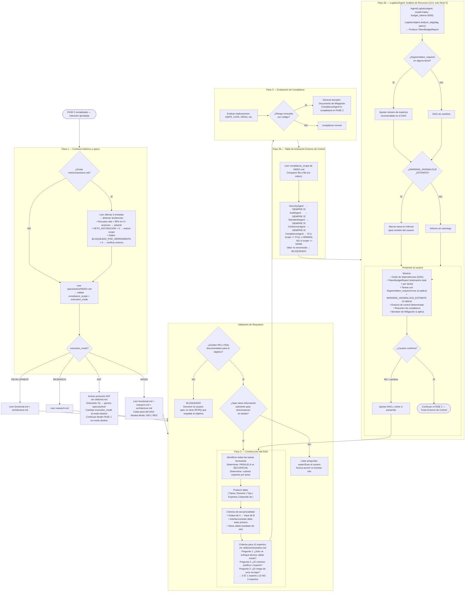

# Flujo 02 — FASE 1: Master Orchestrator — Construcción del DAG
> Proceso: El Master Orchestrator lee specs, descompone el objetivo y presenta el grafo al usuario.
> Fuente: `registry/orchestrator.md` §Protocolo de Activación

