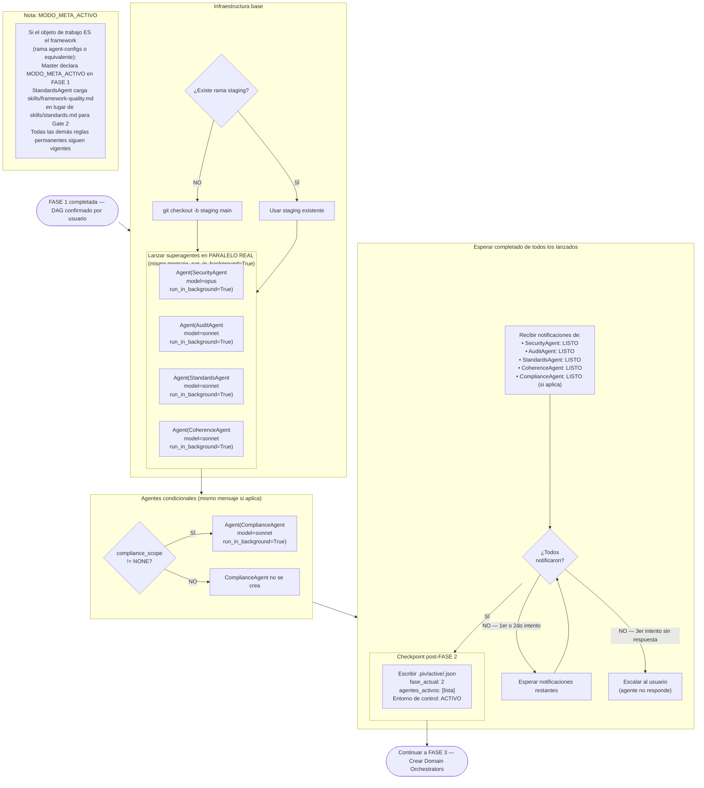

# Flujo 03 — FASE 2: Creación del Entorno de Control
> Proceso: Lanzar todos los superagentes en paralelo real antes de cualquier experto.
> Fuente: `CLAUDE.md` §Protocolo Nivel 2 FASE 2, `registry/orchestrator.md` §Paso 4

