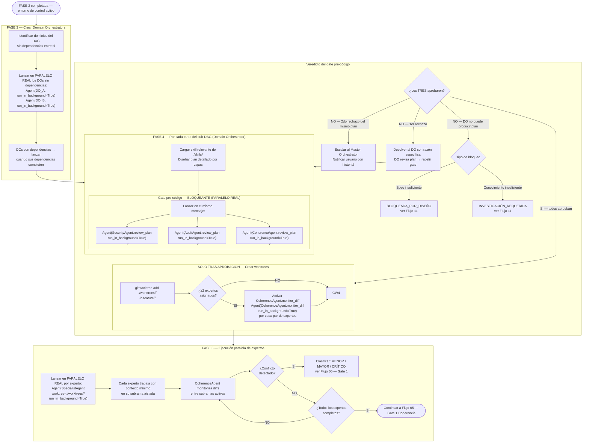

# Flujo 04 — FASES 3–5: Domain Orchestrators + Ejecución de Expertos
> Proceso: Creación de DOs, plan de tarea, gate pre-código, worktrees, expertos paralelos.
> Fuente: `registry/domain_orchestrator.md`, `registry/orchestrator.md` §Paso 4-5



## FASE 5b — Scoring Paralelo (EvaluationAgent)

EvaluationAgent corre en paralelo real con los Specialist Agents desde el inicio de FASE 5.

Acceso: `git show` read-only (nunca `git checkout` de ramas de expertos)
Rubric: `contracts/evaluation.md` (5 dimensiones: FUNC/SEC/QUAL/COH/FOOT)

```
Por cada checkpoint intermedio:
  → Score parcial por experto → registrado en logs_scores/<session_id>.jsonl
  → Si score ≥ early_termination_threshold (0.90): RECOMENDACIÓN DE TERMINACIÓN al Domain Orchestrator
  → DO decide autónomamente si acepta o rechaza la recomendación
```

**Restricciones del EvaluationAgent:**
- Solo lee subramas mediante `git show feature/<tarea>/<experto>:<path>` — nunca `git checkout`
- No puede escribir en ningún worktree de experto
- No emite veredicto de Gate 1 — esa autoridad es exclusiva de CoherenceAgent
- No ejecuta terminación temprana autónomamente — solo emite recomendación al Domain Orchestrator

## FASE 5c — Comparación y Selección

Al completar todos los expertos (o tras early termination aceptada por el DO):

```
  → EvaluationAgent produce ranking final de scores
  → Domain Orchestrator selecciona approach ganador
  → Scores (ganadores + perdedores) registrados en logs_scores/ JSONL (append-only)
  → Scores pasan a CoherenceAgent como insumo para Gate 1
  → CoherenceAgent mantiene autoridad exclusiva del veredicto de Gate 1
```

**Nota:** Si hay un solo experto asignado a la tarea, EvaluationAgent produce el score final sin recomendación de terminación (no hay torneo con un solo participante). Ver `contracts/evaluation.md §Resource Policy`.
