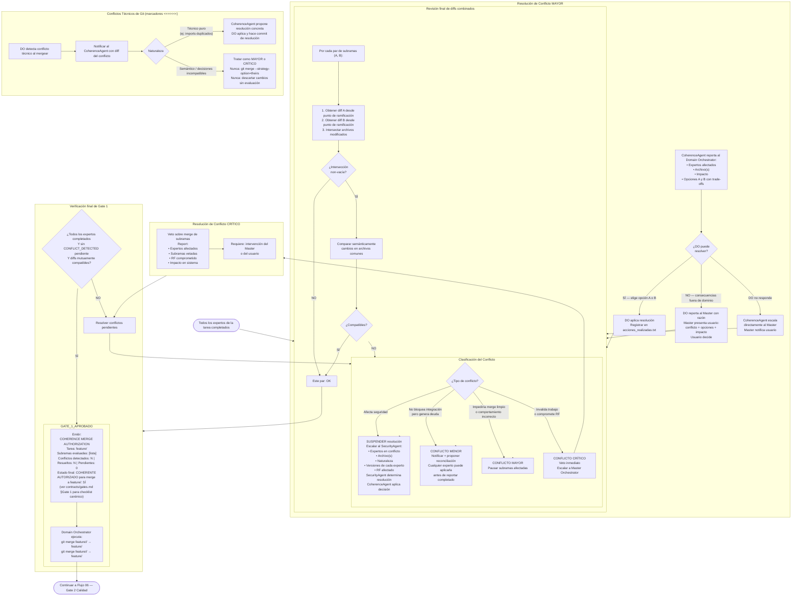

# Flujo 05 — Gate 1: Coherencia (merge subramas → rama de tarea)
> Proceso: CoherenceAgent autoriza el merge de subramas de expertos a la rama de tarea.
> Fuente: `registry/coherence_agent.md` §4–7, `registry/domain_orchestrator.md` §3
> Checklist canónico y condiciones de aprobación: `contracts/gates.md §Gate 1`

## Nota: EvaluationAgent como insumo de Gate 1

EvaluationAgent provee scores 0-1 como insumo informativo para CoherenceAgent. Los scores cubren las dimensiones FUNC/SEC/QUAL/COH/FOOT definidas en `contracts/evaluation.md`.

CoherenceAgent integra los scores en su análisis de coherencia pero **mantiene autoridad exclusiva del veredicto de Gate 1**. EvaluationAgent no puede vetar ni aprobar Gate 1 — su rol es estrictamente informativo.

El flujo de entrega de scores es: `EvaluationAgent → Domain Orchestrator → CoherenceAgent` (scores adjuntos al llamado de Gate 1). Ver `registry/evaluation_agent.md §6` para el protocolo completo.
