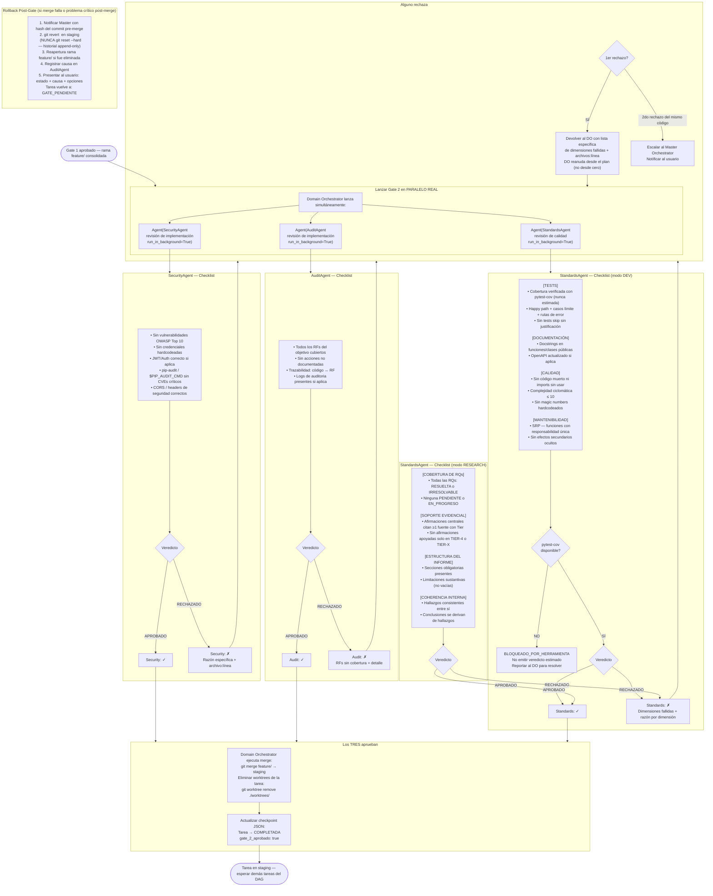

# Flujo 06 — Gate 2: Calidad (merge feature → staging)
> Proceso: Triple gate — Security + Audit + Standards aprueban antes de merge a staging.
> Fuente: `registry/security_agent.md`, `registry/audit_agent.md`, `registry/standards_agent.md`, `CLAUDE.md` §FASE 6

