# Flujo 07 — Gate 3: Confirmación Humana + Merge a Main
> Proceso: El Master presenta el estado completo al usuario. Solo con confirmación humana explícita se ejecuta el merge staging → main.
> Fuente: `registry/orchestrator.md` §Paso 6 — coordinación de gates, `CLAUDE.md` §FASE 7
> Checklist canónico, responsabilidades por agente y criterios de confirmación válida: `contracts/gates.md §Gate 3`

```mermaid
flowchart TD
    START([Todas las tareas del objetivo completadas en staging]) --> INT_REVIEW

    subgraph INT_REVIEW["Revisión Integral de Staging (Security + Audit)"]
        IR1["Lanzar en PARALELO REAL:"]
        direction LR
        IR2["Agent(SecurityAgent\nrevisión integral de staging\nrun_in_background=True)"]
        IR3["Agent(AuditAgent\nrevisión integral de staging\nrun_in_background=True)"]
        IR1 --> IR2
        IR1 --> IR3
    end

    subgraph COMPLIANCE_GATE["ComplianceAgent — Gate 3 (si compliance_scope != NONE)"]
        CG1["Checklist:\n• GDPR/CCPA/LGPD completado si aplica\n• OWASP completado para tipo de producto\n• Licencias de dependencias verificadas\n• Documentación de privacidad presente si aplica\n• Documento de Mitigación reconocido si hubo riesgos"]
        CG1 --> CG2{Veredicto}
        CG2 -->|APROBADO_CON_DISCLAIMER| CMP_OK[Compliance: ✓]
        CG2 -->|REQUIERE_ACCIÓN| CMP_ACT["Bloquear merge\nNotificar usuario con acciones requeridas"]
        CG2 -->|BLOQUEADO| CMP_BLK["Bloquear merge\nRequiere: Documento de Mitigación\nreconocido por usuario"]
    end

    subgraph DOC_GATE["Documentación de Producto (Gate 3 bloqueante)"]
        DG1["StandardsAgent verifica presencia y completitud:\n• README.md completo\n• docs/deployment.md\n• Referencia de API\nDocumentationAgent (Specialist) los genera en FASE 8 si no existen"]
        DG1 --> DG2{¿Documentación\ncompleta?}
        DG2 -->|NO| DG3["BLOQUEADO\nDocumentationAgent genera artefactos faltantes"]
        DG2 -->|SÍ| DOC_OK[Docs: ✓]
        DG3 --> DG2
    end

    INT_REVIEW --> COMPLIANCE_GATE
    INT_REVIEW --> DOC_GATE

    CMP_OK & DOC_OK --> PRESENT_USER

    subgraph PRESENT_USER["Master Orchestrator presenta estado completo"]
        PU1["Informe al usuario:\n• DAG: todas las tareas COMPLETADAS\n• Security: aprobado en staging\n• Audit: aprobado en staging\n• Compliance: aprobado (con disclaimer)\n• Documentación: completa\n• Rama: staging lista para merge a main"]
        PU1 --> PU2["Solicitar confirmación explícita para merge"]
    end

    subgraph CONFIRM_TABLE["Tabla de confirmación válida"]
        CT1["VÁLIDO (≥ 1 de los siguientes):"]
        CT2["a) 'confirmo' o 'merge' (con o sin nombre del objetivo)"]
        CT3["b) 'procede', 'adelante', 'hazlo'\n   + contexto que vincula al merge a main\n   Ej: 'procede con el merge', 'hazlo, sube a main'"]
        CT4["c) Nombre del objetivo en mensaje cuya única\n   interpretación razonable es aprobación\n   Ej: 'sí, [nombre-objetivo]', '[nombre-objetivo] aprobado'"]
        CT5["NO VÁLIDO:\n• 'ok', 'sí', 'hazlo' sin contexto de merge\n• Mensaje sobre tema diferente\n• Respuesta a pregunta distinta en el mismo turno\nSi hay duda → solicitar confirmación específica"]
    end

    PU2 --> USER_RESP{Respuesta del usuario}

    USER_RESP -->|Confirmación válida| MERGE_MAIN
    USER_RESP -->|Rechazo / sin confirmación| NO_MERGE
    USER_RESP -->|Ambigüedad| ASK_AGAIN["Solicitar confirmación específica\ncon nombre del objetivo"]
    ASK_AGAIN --> USER_RESP

    subgraph NO_MERGE["Sin confirmación humana"]
        NM1["staging permanece intacto indefinidamente\nEstado: GATE3_RECORDATORIO_PENDIENTE\nTras gate3_reminder_hours horas (default: 24h):\nMaster emite recordatorio pasivo\nNunca acción automática"]
    end

    subgraph MERGE_MAIN["Merge staging → main (único merge autónomo permitido)"]
        MM1["Master Orchestrator ejecuta:\ngit merge staging → main"]
        MM1 --> MM2["Mover:\n.piv/active/<objetivo-id>.json\n→ .piv/completed/<objetivo-id>.json\nActualizar: timestamp_cierre, resultado: COMPLETADO"]
    end

    MM2 --> FASE8b["FASE 8b: Registro de Precedente\nAuditAgent registra precedente\nen engram/precedents/\nestado: REGISTRADO → VALIDADO post-Gate 3"]
    FASE8b --> FASE8([Continuar a Flujo 08 — FASE 8 Cierre])
```



## FASE 8b — Registro de Precedente (post-Gate 3)

Inmediatamente tras la confirmación del merge en Gate 3, el AuditAgent registra el precedente de la sesión:

```
AuditAgent (delegación a EvaluationAgent como sub-agente, profundidad 1):
  ├── Escribe: engram/precedents/<id>.md (estado inicial: REGISTRADO)
  ├── Actualiza: engram/precedents/INDEX.md
  ├── Confirma Gate 3 → estado del precedente: VALIDADO
  └── SHA-256 del registro en engram/audit/gate_decisions.md
```

Solo precedentes en estado `VALIDADO` son elegibles como input en sesiones futuras. Ver `registry/evaluation_agent.md §7` para el protocolo completo de precedentes.
