# Flujo 08 — FASE 8: Cierre
> Proceso: Logs, métricas, engram, TechSpecSheet, propuestas de skills, Delivery Package.
> Fuente: `CLAUDE.md` §FASE 8, `registry/audit_agent.md`, `registry/standards_agent.md`

```mermaid
flowchart TD
    START([Gate 3 completado — merge a main ejecutado]) --> PARALLEL_CLOSE

    subgraph PARALLEL_CLOSE["Actividades de cierre en paralelo"]
        direction LR
        AUDIT_CLOSE["AuditAgent"]
        STD_CLOSE["StandardsAgent"]
        CMP_CLOSE["ComplianceAgent (si activo)"]
        COH_CLOSE["CoherenceAgent"]
        EA_CLOSE["ExecutionAuditor ← v4.0\n(genera reporte final OOB)"]
    end

    subgraph EA_TASKS["ExecutionAuditor — Reporte final (v4.0, OOB)"]
        EAT1["ExecutionAuditor.generate_final_report()\nCorre en paralelo con los otros cierres\nGenera SIEMPRE — incluso si ejecución principal falla"]
        EAT1 --> EAT2["ExecutionAuditReport contiene:\n• total_events, total_irregularities\n• critical_irregularities\n• gate_compliance_rate\n• tokens_per_agent\n• pmia_messages_total, pmia_retries\n• summary (< 100 tokens)"]
        EAT2 --> EAT3["Entregar reporte como insumo a AuditAgent\n(no lo sustituye — lo complementa)\nVer: metrics/execution_audit_schema.md"]
    end

    subgraph AUDIT_TASKS["AuditAgent — Tareas de cierre"]
        AT1["Generar logs en logs_veracidad/<product-id>/ (append-only, v4.0):\n• acciones.jsonl\n• uso_contexto.jsonl\n• verificacion_rf.jsonl\nUsar scripts/fase8_auto.py para generación automática"]
        AT1 --> AT2["Ejecutar Reporte de Conformidad de Protocolo\n(verificar que todas las fases se ejecutaron\nsegún el protocolo del framework)\nIncluir ExecutionAuditReport como insumo"]
        AT2 --> AT3["Registrar métricas en metrics/sessions.md (append-only)\nNunca estimar — solo valores de herramientas o logs:\n• first_pass_rate, gate_rejections, veto_saturacion\n• cobertura, tareas, expertos, duración"]
        AT3 --> AT4["Recolectar outputs de:\n• StandardsAgent\n• SecurityAgent\n• ComplianceAgent\nGenerar TechSpecSheet en:\n/compliance/<objetivo>/delivery/TECH_SPEC_SHEET.md\nEstándar: ISO/IEC/IEEE 29148:2018 + ISO/IEC 25010:2023"]
        AT4 --> AT5["Actualizar átomos engram/ según dominio\n(NO session_learning.md — DEPRECATED):\n• engram/core/ — Master Orchestrator\n• engram/security/ — SecurityAgent\n• engram/audit/ — AuditAgent\n• engram/quality/ — StandardsAgent\n• engram/domains/ — Domain Orchestrators"]
    end

    subgraph STD_TASKS["StandardsAgent — Propuesta de actualización de /skills/"]
        ST1["Analizar patrones de la sesión:"]
        ST1 --> ST2{¿Patrón califica?}
        ST2 -->|"(a) Aplicado exitosamente ≥2 tareas independientes\nO\n(b) Ausencia causó ≥1 rechazo de Gate 2"| ST3["Generar propuesta estructurada:\n• Tarea origen\n• Adiciones propuestas a /skills/<archivo>.md\n• Correcciones propuestas\n• Justificación con evidencia: archivo:línea / resultado test / rechazo gate"]
        ST2 -->|Solo 1 aplicación sin rechazo| ST_OBS["Registrar como 'observación'\nen /engram/skills_proposals/\nSin propuesta formal"]
        ST3 --> ST4["Someter propuesta al SecurityAgent\n¿Introduce patrones inseguros?"]
        ST4 -->|SecurityAgent aprueba| ST5["Presentar al usuario con propuesta completa"]
        ST4 -->|SecurityAgent rechaza| ST6["Archivar en /engram/skills_proposals/\npendiente de revisión futura"]
        ST5 --> ST7{¿Usuario confirma\nexplícitamente?}
        ST7 -->|SÍ| ST8["StandardsAgent aplica cambios a /skills/"]
        ST7 -->|NO / sin respuesta| ST6
    end

    subgraph COH_TASKS["CoherenceAgent — Engram de coherencia"]
        CT1["Actualizar engram/coherence/conflict_patterns.md:\n• Conflictos detectados por tipo\n• Patrones recurrentes\n• Recomendaciones para futuras tareas paralelas"]
    end

    subgraph CMP_TASKS["ComplianceAgent — Informe y Delivery Package"]
        CP1["Generar informe final:\n/compliance/<objetivo>/<objetivo>_compliance.md\n→ Estándares evaluados\n→ Checklists completados\n→ Riesgos documentados\n→ Dependencias y licencias\n→ DISCLAIMER obligatorio"]
        CP1 --> CP2["Ensamblar Delivery Package:\n/compliance/<objetivo>/delivery/\n├── README_DEPLOY.md\n├── COMPLIANCE_REPORT.md\n├── PRIVACY_NOTICE.md (si datos personales)\n├── SECURITY_POLICY.md\n├── LICENSES.md\n└── translations/ (si riesgo legal en mercado no anglófono)"]
        CP2 --> CP3["Cada entregable incluye:\n'Requiere revisión humana antes de despliegue'\nComplianceAgent NUNCA garantiza compliance legal"]
    end

    PARALLEL_CLOSE --> EA_TASKS
    PARALLEL_CLOSE --> AUDIT_TASKS
    PARALLEL_CLOSE --> STD_TASKS
    PARALLEL_CLOSE --> COH_TASKS
    PARALLEL_CLOSE --> CMP_TASKS

    EA_TASKS --> AUDIT_TASKS

    AUDIT_TASKS & STD_TASKS & COH_TASKS & CMP_TASKS --> ATOMIZATION_CHECK

    subgraph ATOMIZATION_CHECK["StandardsAgent — Revisión de Atomización Condicional"]
        AC1{¿Algún archivo del framework > 500 líneas?}
        AC1 -->|SÍ| AC2{¿Cumple ≥2 de:\n• Carga independiente por distintos agentes\n• Ciclos de actualización distintos\n• Responsabilidad mixta?}
        AC2 -->|SÍ| AC3["Candidato a atomización\nProponer en siguiente sesión de mejora"]
        AC2 -->|NO| AC4[Exento de atomización]
        AC1 -->|NO| AC4
    end

    AC4 & AC3 --> END([FASE 8 completada — Objetivo cerrado])
```

