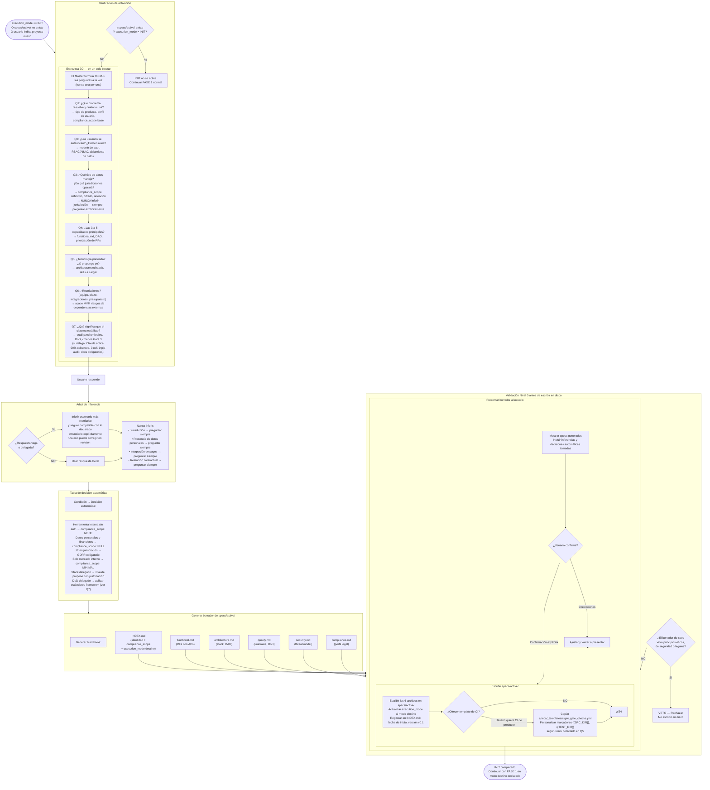

# Flujo 09 — Protocolo INIT: Entrevista 7Q → specs/active/
> Proceso: Cuando no existen specs o el modo es INIT, el Master conduce entrevista estructurada.
> Fuente: `skills/init.md`

```mermaid
flowchart TD
    START([execution_mode == INIT\nO specs/active/ no existe\nO usuario indica proyecto nuevo]) --> TRIGGER_CHECK

    subgraph TRIGGER_CHECK["Verificación de activación"]
        TC1{¿specs/active/ existe\nY execution_mode ≠ INIT?}
        TC1 -->|SÍ| TC_SKIP[INIT no se activa\nContinuar FASE 1 normal]
        TC1 -->|NO| INTERVIEW
    end

    subgraph INTERVIEW["Entrevista 7Q — en un solo bloque"]
        IV1["El Master formula TODAS las preguntas a la vez\n(nunca una por una)"]
        IV1 --> IV2["Q1: ¿Qué problema resuelve y quién lo usa?\n→ tipo de producto, perfil de usuario, compliance_scope base"]
        IV2 --> IV3["Q2: ¿Los usuarios se autentican? ¿Existen roles?\n→ modelo de auth, RBAC/ABAC, aislamiento de datos"]
        IV3 --> IV4["Q3: ¿Qué tipo de datos maneja?\n¿En qué jurisdicciones operará?\n→ compliance_scope definitivo, cifrado, retención\n→ NUNCA inferir jurisdicción — siempre preguntar explícitamente"]
        IV4 --> IV5["Q4: ¿Las 3 a 5 capacidades principales?\n→ functional.md, DAG, priorización de RFs"]
        IV5 --> IV6["Q5: ¿Tecnología preferida? ¿O propongo yo?\n→ architecture.md stack, skills a cargar"]
        IV6 --> IV7["Q6: ¿Restricciones? (equipo, plazo, integraciones, presupuesto)\n→ scope MVP, riesgos de dependencias externas"]
        IV7 --> IV8["Q7: ¿Qué significa que el sistema está listo?\n→ quality.md umbrales, DoD, criterios Gate 3\n(si delega: Claude aplica 90% cobertura, 0 ruff, 0 pip-audit, docs obligatorios)"]
    end

    IV8 --> USER_RESP[Usuario responde]

    subgraph INFERENCE["Árbol de inferencia"]
        INF1{¿Respuesta vaga\no delegada?}
        INF1 -->|SÍ| INF2["Inferir escenario más restrictivo\ny seguro compatible con lo declarado\nAnunciarlo explícitamente\nUsuario puede corregir en revisión"]
        INF1 -->|NO| INF3[Usar respuesta literal]
        INF2 & INF3 --> INF4["Nunca inferir:\n• Jurisdicción → preguntar siempre\n• Presencia de datos personales → preguntar siempre\n• Integración de pagos → preguntar siempre\n• Retención contractual → preguntar siempre"]
    end

    USER_RESP --> INFERENCE

    subgraph DECISION_TABLE["Tabla de decisión automática"]
        DT1["Condición → Decisión automática:"]
        DT2["Herramienta interna sin auth → compliance_scope: NONE\nDatos personales o financieros → compliance_scope: FULL\nUE en jurisdicción → GDPR obligatorio\nSolo mercado interno → compliance_scope: MINIMAL\nStack delegado → Claude propone con justificación\nDoD delegado → aplicar estándares framework (ver Q7)"]
    end

    INFERENCE --> DECISION_TABLE

    subgraph GEN_SPECS["Generar borrador de specs/active/"]
        GS1["Generar 6 archivos:"]
        direction LR
        GS2["INDEX.md\n(identidad + compliance_scope\n+ execution_mode destino)"]
        GS3["functional.md\n(RFs con ACs)"]
        GS4["architecture.md\n(stack, DAG)"]
        GS5["quality.md\n(umbrales, DoD)"]
        GS6["security.md\n(threat model)"]
        GS7["compliance.md\n(perfil legal)"]
    end

    DECISION_TABLE --> GEN_SPECS

    GS2 & GS3 & GS4 & GS5 & GS6 & GS7 --> NIVEL0_VAL

    subgraph NIVEL0_VAL["Validación Nivel 0 antes de escribir en disco"]
        NV1{¿El borrador de spec\nviola principios éticos,\nde seguridad o legales?}
        NV1 -->|SÍ| NV_VETO["VETO — Rechazar\nNo escribir en disco"]
        NV1 -->|NO| PRESENT_DRAFT
    end

    subgraph PRESENT_DRAFT["Presentar borrador al usuario"]
        PD1["Mostrar specs generados\nIncluir inferencias y decisiones automáticas tomadas"]
        PD1 --> PD2{¿Usuario confirma?}
        PD2 -->|"Correcciones"| ITERATE[Ajustar y volver a presentar]
        PD2 -->|"Confirmación explícita"| WRITE_SPECS
        ITERATE --> PRESENT_DRAFT
    end

    subgraph WRITE_SPECS["Escribir specs/active/"]
        WS1["Escribir los 6 archivos en specs/active/\nActualizar execution_mode al modo destino\nRegistrar en INDEX.md: fecha de inicio, versión v0.1"]
        WS1 --> WS2{¿Ofrecer template de CI?}
        WS2 -->|"Usuario quiere CI de producto"| WS3["Copiar specs/_templates/ci/piv_gate_checks.yml\nPersonalizar marcadores {{SRC_DIR}}, {{TEST_DIR}}\nsegún stack detectado en Q5"]
        WS2 -->|NO| WS4
        WS3 --> WS4
    end

    WRITE_SPECS --> END([INIT completado\nContinuar con FASE 1 en modo destino declarado])
```
