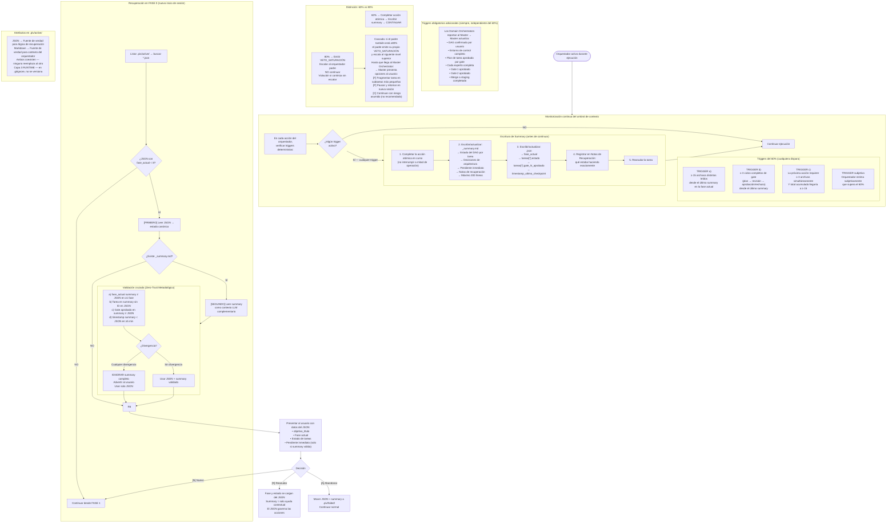

# Flujo 10 — Continuidad de Sesión: Regla del 60% + Recuperación en FASE 0
> Proceso: Escritura proactiva de estado antes de compresión + recuperación tras reinicio.
> Fuente: `skills/session-continuity.md`, `registry/orchestrator.md` §Protocolo de Checkpoint

