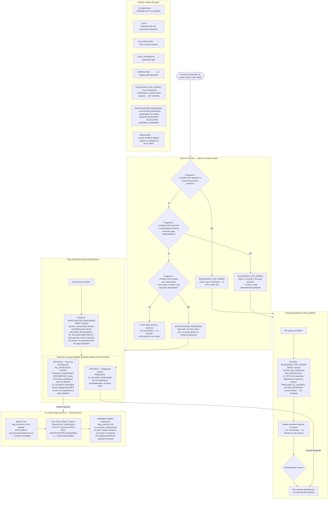

# Flujo 11 — Bloqueos: BLOQUEADA_POR_DISEÑO vs INVESTIGACIÓN_REQUERIDA
> Proceso: Árbol de decisión del Domain Orchestrator cuando no puede producir un plan válido.
> Fuente: `registry/orchestrator.md` §Paso 6 — coordinación de gates

