# Flujo 12 — Modo Meta: Framework Quality Gate (MODO_META_ACTIVO)
> Proceso: Cuando el objeto de trabajo ES el framework, los gates de producto se reemplazan por equivalentes deterministas.
> Fuente: `skills/framework-quality.md`, `CLAUDE.md` §Reglas Permanentes — Modo Meta

```mermaid
flowchart TD
    START([Objetivo activo sobre el framework\nramas agent-configs o equivalente]) --> DETECT

    subgraph DETECT["Detección de MODO_META_ACTIVO (algoritmo 4 pasos — agent.md §8)"]
        D1["PASO 1: git branch --show-current"]
        D1 -->|"rama == 'agent-configs'\no prefijo 'agent-configs/'"| D2["Master Orchestrator declara\nMODO_META_ACTIVO = true en FASE 1\n(explícitamente, no implícitamente)"]
        D1 -->|"otra rama"| D1B["PASO 2: ¿Existe specs/active/INDEX.md\nen disco?"]
        D1B -->|NO| D2
        D1B -->|SÍ| D1C["PASO 3: Leer campo objetivo_activo\nde specs/active/INDEX.md"]
        D1C -->|"vacío / [PENDIENTE] / ausente"| D2
        D1C -->|"objetivo real de producto"| D3["MODO_META_ACTIVO = false\nModo normal — usar\ngates de producto estándar"]
        D2 --> D1D["PASO 4: Registrar valor en checkpoint\n(campo 'modo_meta').\nIncluir en prompt de StandardsAgent."]
        D3 --> D1D
        D1D -->|MODO_META = true| SEPARATION
        D1D -->|MODO_META = false| D3_END([Continuar con protocolo normal])
    end

    subgraph SEPARATION["Separación Directiva/Artefacto"]
        S1["agent-configs contiene EXCLUSIVAMENTE\narchivos del framework PIV/OAC\nCódigo de producto NUNCA aquí"]
        S1 --> S2["Ramas artefacto se crean SIEMPRE desde main\nNUNCA desde agent-configs"]
        S2 --> S3["El .gitignore de agent-configs lista\nexplícitamente todos los directorios de proyecto"]
        S3 --> S4["Violación = contaminación del modelo directivo"]
    end

    SEPARATION --> EQUIVALENCES

    subgraph EQUIVALENCES["Equivalencias — Herramientas antes de LLM"]
        EQ1["Gate de PRODUCTO → Equivalente de FRAMEWORK"]
        EQ2["pytest-cov ≥ 90%\n→ Check 1: Cross-Reference Integrity\n   Todos los archivos referenciados en el objetivo existen\n   Herramienta: glob + grep\n   Resultado esperado: 0 referencias rotas"]
        EQ3["ruff: 0 errores\n→ Check 2: Structural Completeness\n   Registry files tienen todas las secciones requeridas\n   Herramienta: grep (headers ## N.)\n   Mínimo: ## 1. Identidad + Restricciones + Referencias Cruzadas"]
        EQ4["pip-audit: 0 vulnerabilidades\n→ Check 3: Protocol Integrity\n   Todos los estados, modos y agentes citados\n   tienen entrada canónica en su registry\n   Herramienta: grep\n   Resultado esperado: 0 referencias sin entrada"]
        EQ5["Definition of Done\n→ Check 4: Sin Placeholders en Framework\n   0 ocurrencias de [PENDIENTE] en:\n   registry/*.md / skills/*.md / agent.md / CLAUDE.md\n   Exentos: specs/ (son templates de proyecto)\n   Herramienta: grep -rn"]
    end

    subgraph GATE2_META["Gate 2 en MODO_META (StandardsAgent)"]
        G2["StandardsAgent carga skills/framework-quality.md\nen lugar de skills/standards.md\n\nEjecuta los 4 checks con herramientas deterministas:"]
        G2 --> G2A["Check 1 — Cross-Ref:\nExtrae referencias tipo \`ruta/archivo.md\`\nde archivos modificados en el objetivo\n→ Verifica existencia con glob"]
        G2 --> G2B["Check 2 — Structural:\nVerifica presencia de secciones ## en registry files\n→ Verifica: ## 1. + Restricciones + Referencias Cruzadas"]
        G2 --> G2C["Check 3 — Protocol:\n1. execution_modes en CLAUDE.md → valores válidos en INDEX.md\n2. Estados del Master en CLAUDE.md → tabla en orchestrator.md\n3. Agentes en tabla de Asignación → registry/ o agent_taxonomy.md"]
        G2 --> G2D["Check 4 — No Placeholders:\ngrep -rn '[PENDIENTE]' en archivos de framework\n→ Excluyendo specs/"]
    end

    subgraph FRAMEWORK_DOD["Framework Definition of Done"]
        FD1["Objetivo COMPLETADO solo cuando:"]
        FD2["1. Check 1: 0 referencias rotas"]
        FD3["2. Check 2: registry files estructuralmente completos"]
        FD4["3. Check 3: 0 entidades sin entrada canónica"]
        FD5["4. Check 4: 0 [PENDIENTE] en archivos de framework"]
        FD6["5. Gate pre-código aprobado por Security + Audit + Coherence"]
        FD7["6. Gate 2 aprobado por Security + Audit + Standards (este checklist)"]
        FD8["7. Merge a staging ejecutado tras Gate 2"]
    end

    subgraph REPORT_FORMAT["Formato de reporte del StandardsAgent"]
        RF1["FRAMEWORK QUALITY GATE — [nombre del objetivo]\nModo: MODO_META_ACTIVO\n\nCheck 1 — Cross-Reference Integrity:   X/Y refs válidas — [PASS/FAIL]\nCheck 2 — Structural Completeness:     X/Y archivos completos — [PASS/FAIL]\nCheck 3 — Protocol Integrity:          X/Y entradas canónicas — [PASS/FAIL]\nCheck 4 — No Pending Placeholders:     X ocurrencias — [PASS/FAIL]\n\nVeredicto: APROBADO | RECHAZADO\nAcción correctiva: [si RECHAZADO: archivo:línea + fix requerido]"]
    end

    subgraph SKILLS_UPDATE["Actualización de /skills/ — SOLO con double gate"]
        SU1["StandardsAgent propone cambios a /skills/"]
        SU1 --> SU2["SecurityAgent revisa la propuesta\n¿Introduce patrones inseguros?"]
        SU2 -->|APRUEBA| SU3["Presentar al usuario con propuesta completa"]
        SU2 -->|RECHAZA| SU4["Archivar en /engram/skills_proposals/"]
        SU3 --> SU5{¿Confirmación\nhumana explícita?}
        SU5 -->|SÍ| SU6["StandardsAgent aplica cambios a /skills/"]
        SU5 -->|NO| SU4
        SU6 --> SU7["Skills Inmutables durante ejecución de objetivo\n/skills/ solo se modifica TRAS Gate 3"]
    end

    EQUIVALENCES --> GATE2_META
    GATE2_META --> FRAMEWORK_DOD
    FRAMEWORK_DOD --> REPORT_FORMAT
    REPORT_FORMAT --> SKILLS_UPDATE
```

## EvaluationAgent en MODO_META

En MODO_META_ACTIVO, EvaluationAgent aplica el mismo mecanismo de scoring 0-1 pero las dimensiones se adaptan a trabajo de framework (no producto):

| Dimensión | Equivalente Meta |
|-----------|-----------------|
| FUNC | Completitud de los cambios declarados en el objetivo meta |
| SEC | Check 3 de `framework-quality.md` (integridad de protocolo) |
| QUAL | Check 1 + Check 2 de `framework-quality.md` (cross-refs + estructura) |
| COH | Coherencia con principios del framework existente |
| FOOT | Archivos modificados vs archivos declarados en el plan |

**Herramientas en MODO_META:** Las dimensiones SEC y QUAL usan herramientas deterministas (glob, grep) en lugar de semgrep/pytest-cov/ruff. La lógica de BLOQUEADO_POR_HERRAMIENTA aplica igual.

El precedente registrado post-Gate 3 tiene `task_type: META` en `engram/precedents/INDEX.md`. Solo precedentes META con estado `VALIDADO` y score ≥ 0.85 son elegibles como estrategia de partida en sesiones meta futuras.
