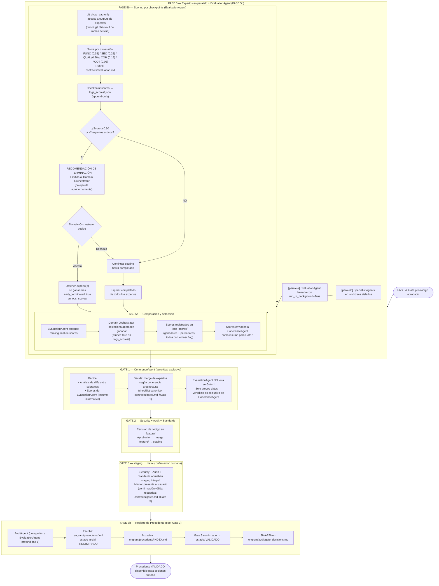
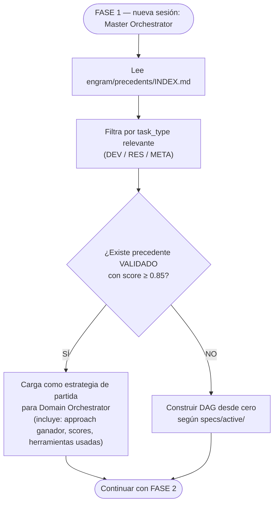

# Flow 13 — Evaluation & Precedents System

> Parte del redesign PIV/OAC v3.3 (evaluation layer).
> Describe el ciclo completo: scoring paralelo → torneo → precedente.
> Fuente: `contracts/evaluation.md`, `registry/evaluation_agent.md`, `contracts/gates.md §Gate 1`

## Contexto

- EvaluationAgent activo desde FASE 5
- CoherenceAgent mantiene autoridad exclusiva de Gate 1
- Precedentes: solo post-Gate 3 en estado VALIDADO

## Flujo Completo

## Uso en Sesiones Futuras

## Archivos de Referencia

| Archivo | Rol |
|---------|-----|
| `contracts/evaluation.md` | Rubric de scoring — 5 dimensiones, pesos, schema JSONL |
| `contracts/parallel_safety.md` | Protocolo de aislamiento y early termination |
| `contracts/gates.md §Gate 1` | CoherenceAgent como única autoridad de Gate 1 |
| `registry/evaluation_agent.md` | Protocolo completo del agente |
| `registry/coherence_agent.md` | Consumidor de scores — Gate 1 |
| `registry/audit_agent.md` | Escritor principal de `engram/precedents/` |
| `engram/precedents/INDEX.md` | Destino de precedentes validados |
| `logs_scores/` | Registros JSONL de scoring (append-only) |
